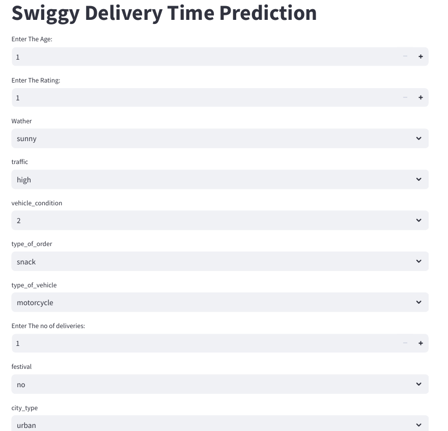
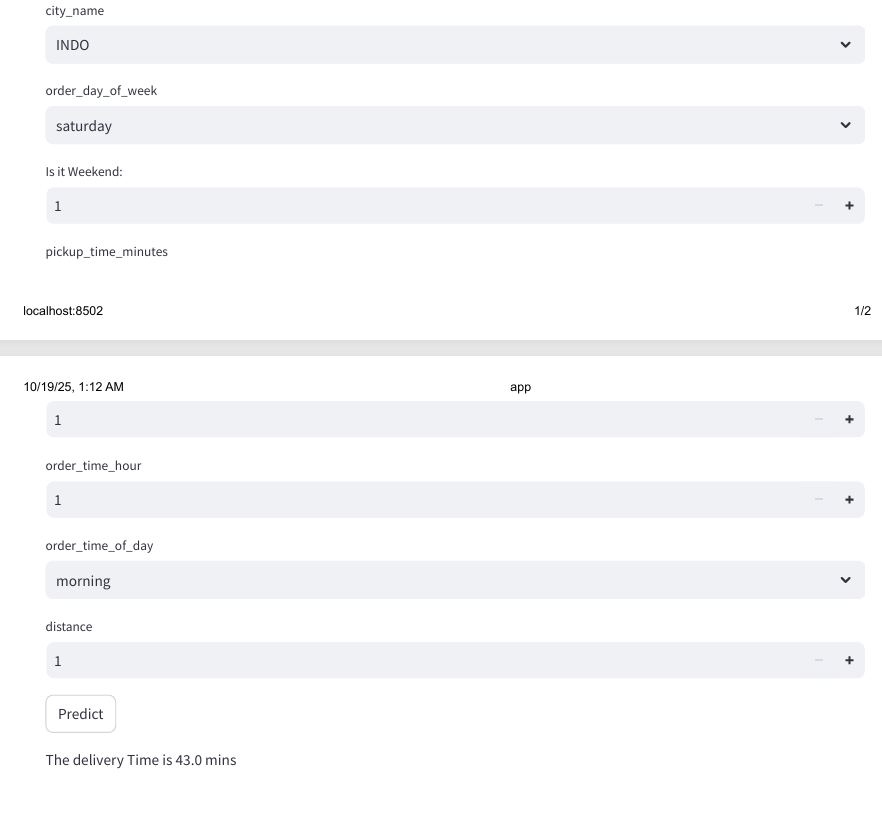

# Swiggy-DishPatch-AI-Based-Delivery-Time-Prediction-System
Swiggy DishPatch is a Machine Learning–powered project that predicts food delivery time based on various real-world factors such as restaurant preparation time, rider location, traffic density, distance, weather conditions, and customer order patterns.

### 📌 Overview
**Swiggy DishPatch** is an AI-powered system that predicts the **estimated delivery time (ETA)** for food orders based on factors like restaurant preparation time, traffic conditions, weather, and delivery distance.  
This helps food delivery platforms like **Swiggy** and **Zomato** enhance operational efficiency and improve customer experience.

---

## 🧠 Features
- 🧹 **Data Preprocessing** – Cleaned and transformed order data for modeling.  
- 🤖 **Machine Learning Model** – Used Random Forest, XGBoost, and Linear Regression for ETA prediction.  
- 🌦️ **Feature Engineering** – Integrated distance, weather, time-of-day, and traffic parameters.  
- 🖥️ **Web Interface** – Built using **Flask + HTML/CSS/JS** for real-time ETA prediction.  
- 📊 **Visualization Dashboard** – Plotted performance metrics and model comparisons.

---

## ⚙️ Tech Stack
- **Languages:** Python  
- **Libraries:** Pandas, NumPy, Scikit-learn, XGBoost, Matplotlib, Seaborn  
- **Framework:** Flask  
- **Frontend:** HTML, CSS, JavaScript  

---

## IMAGES

## Project Execution Steps

## 1️⃣ Clone the Repository
git clone https://github.com/Sai-Chandana-353/Swiggy-DishPatch-AI-Based-Delivery-Time-Prediction-System.git
cd Swiggy-DishPatch-AI-Based-Delivery-Time-Prediction-System

## 2️⃣ Create a Virtual Environment (Recommended)
## For Windows:
python -m venv venv
venv\Scripts\activate

## For Mac/Linux:
python3 -m venv venv
source venv/bin/activate

## 3️⃣ Install Dependencies

If you have a requirements.txt file:

pip install -r requirements.txt

If not, install common packages manually:

pip install flask pandas numpy scikit-learn xgboost

## 4️⃣ Place Your Data & Models

data/ folder: Ensure orders.csv and traffic_data.csv are present.

models/ folder: Ensure rf_model.pkl and xgb_model.pkl exist.

static/ and templates/ folders: Should have CSS, JS, and HTML files in place.

## 5️⃣ Run the Flask App
python app.py

By default, Flask runs at:

http://127.0.0.1:5000

Open this URL in your browser to access the web app.

## 6️⃣ Interact with the App

Input order details (or sample data) in the web interface.

The app will use your ML models (rf_model.pkl or xgb_model.pkl) to predict delivery time.

Results will display on the webpage dynamically.

